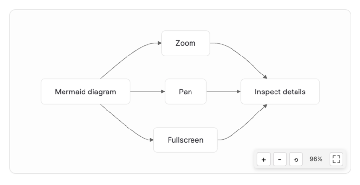
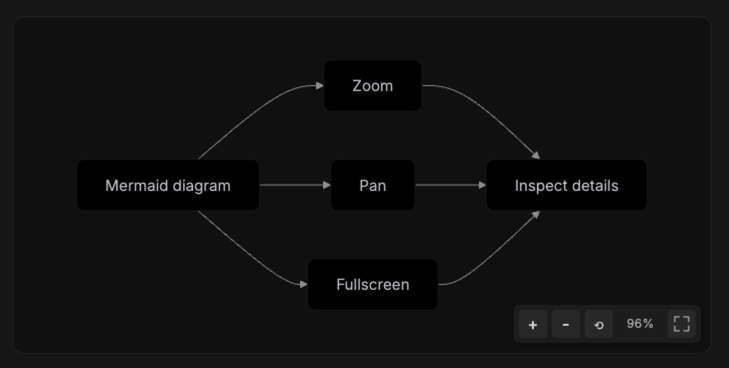

# Codex Mermaid Enhancer

Codex Mermaid Enhancer improves Mermaid diagrams in Obsidian with a cleaner Codex-style visual treatment and interaction model designed for trackpads and Apple Magic Mouse.

It is based on the original Mermaid Zoom plugin, but changes the default desktop behavior from wheel-to-zoom to pan-first navigation.


## Preview

### Light mode



### Dark mode



## Features

- **Codex-style diagrams**: rounded diagram cards, subdued borders, and light/dark colors tuned for Obsidian.
- **Pan-first wheel interaction**: scroll over a diagram to move it instead of accidentally zooming.
- **Shortcut zoom**: hold `Cmd` on macOS or `Ctrl` on other platforms while scrolling to zoom at the pointer position.
- **Drag to pan**: click and drag to move around large diagrams.
- **Control buttons**: use `+`, `-`, reset, and fullscreen controls when precise actions are easier than gestures.
- **Fullscreen view**: open a diagram in a modal with the same pan and zoom behavior.
- **Touch gestures**: pinch to zoom and drag to pan on touch devices.
- **Flowchart decision cleanup**: flowchart decision nodes are normalized before Mermaid renders them, keeping edges connected while matching the rounded-card visual style.

## Installation

### BRAT

1. Install the [BRAT](https://github.com/TfTHacker/obsidian42-brat) plugin.
2. Add this repository as a beta plugin:
   ```
   https://github.com/Al-assad/obsidian-mermaid-enhancer
   ```
3. Enable **Codex Mermaid Enhancer** in Obsidian settings.

### Manual Installation

1. Download the latest release from [GitHub Releases](https://github.com/Al-assad/obsidian-mermaid-enhancer/releases).
2. Extract the release files into:
   ```text
   <your-vault>/.obsidian/plugins/codex-mermaid-enhancer
   ```
3. Enable **Codex Mermaid Enhancer** from Obsidian:
   ```text
   Settings -> Community plugins -> Installed plugins
   ```

## Usage

### Desktop Controls

| Action | Gesture |
| --- | --- |
| Pan | Scroll over the diagram |
| Zoom | Hold `Cmd` or `Ctrl` and scroll |
| Pan by drag | Left-click and drag |
| Zoom in | Click `+` |
| Zoom out | Click `-` |
| Reset | Click `reset` to fit the diagram back into the card |
| Fullscreen | Click the fullscreen button |

### Touch Controls

| Action | Gesture |
| --- | --- |
| Pan | Drag with one finger |
| Zoom | Pinch with two fingers |

## Development

```bash
npm install
npm run dev
npm run build
```

The plugin is implemented mainly in `main.ts` and styles are in `styles.css`.

## Release Files

Each release should include:

```text
main.js
manifest.json
styles.css
```

## License

[MIT](LICENSE)

This project is a fork of [xiaozhuang0433/mermaid-zoom](https://github.com/xiaozhuang0433/mermaid-zoom).
